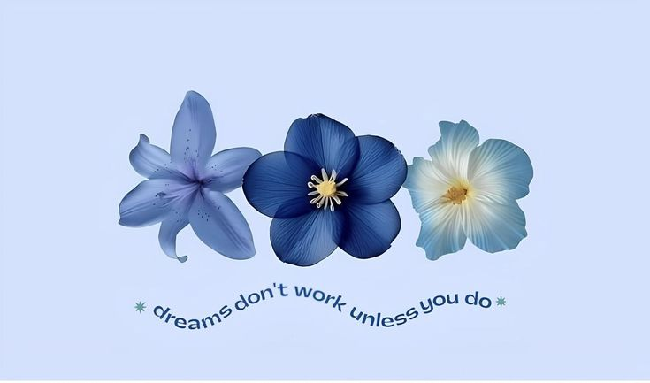

  

<h1 align="center">Hi, I'm <b>Sim</b> 👋</h1>

<i>Computer Science Graduate • Artificial Intelligence • Machine Learning • Deep Learning</i>

---

# ✨ About Me

I'm **Sim**, a passionate learner focused on **Artificial Intelligence**, **Machine Learning**, **Deep Learning**, and **Generative AI**.

I enjoy building practical AI applications, understanding how modern ML systems work, and continuously improving through hands-on projects.

> *"Good things take time, but consistency makes them happen."*

---

# 🚀 Current Focus

- **Retrieval-Augmented Generation (RAG)**
- **Large Language Models (LLMs)**
- **Deep Learning**
- **Transformer Architecture**
- **AI Agents**
- **Open Source Contributions**
- **GATE CSE 2027**

---

# 💻 Tech Stack

### Languages

### AI & ML

---

# 📌 Upcoming Projects

### 🧠 Intelligent RAG Assistant

*A production-ready Retrieval-Augmented Generation system using vector databases, embedding models, and modern LLMs.*

**Status:** 🟢 **Coming Soon**

---

### 🧘 NutriPose Pro

*An AI-powered yoga posture correction platform using computer vision and deep learning.*

**Status:** 🟢 **Coming Soon**

---

### 🎤 SPEKTRUM AI

*A real-time AI communication coach powered by speech recognition and Large Language Models.*

**Status:** 🟢 **Coming Soon**

---

### 🤖 AI Agents

*Autonomous multi-agent workflows built using modern LLM frameworks.*

**Status:** 🟢 **Coming Soon**

---

# 📈 GitHub Analytics

---

# 🌱 Currently Learning

- **Deep Learning**
- **LLM Fine-tuning**
- **Vector Databases**
- **LangChain**
- **AI Agents**
- **System Design**
- **Advanced Machine Learning**

---

# 🤝 Connect

<a href="www.linkedin.com/in/simransandal"

</a>

---

### <b><i>Building meaningful AI solutions through continuous learning.</i></b>

<i>Thanks for visiting my profile ⭐</i>

