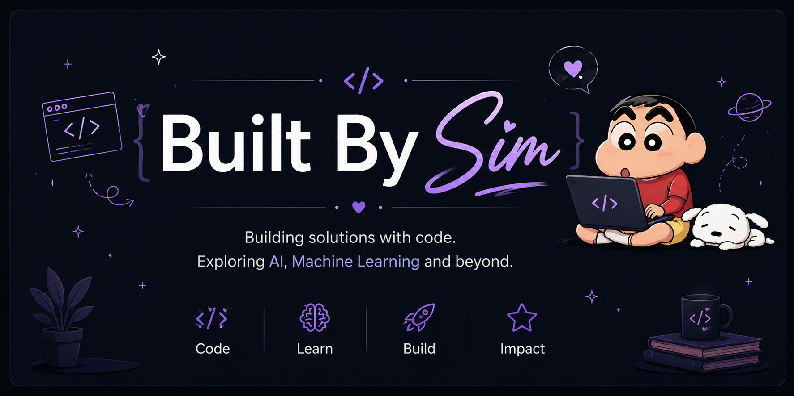

<p align="center">
  
</p>

<h1 align="center">Hi there 👋 I'm Sim</h1>

<h3 align="center">
Building intelligent solutions with AI, one project at a time.
</h3>

<p align="center">
I'm a Computer Science graduate passionate about Artificial Intelligence,
Machine Learning, Deep Learning, and Generative AI.

I enjoy transforming ideas into practical applications while continuously
learning, experimenting, and contributing to open-source projects.

</p>

---

## 🌸 About Me

```python
class Sim:

    name = "Sim"

    role = "AI Developer"

    interests = [
        "Machine Learning",
        "Deep Learning",
        "Generative AI",
        "Large Language Models",
        "Retrieval-Augmented Generation",
        "Computer Vision"
    ]

    motto = "Code • Learn • Build • Repeat"
```

---

## 🚀 Currently Exploring

* 🤖 Deep Learning
* 🧠 Transformers & LLMs
* 🔍 Retrieval-Augmented Generation (RAG)
* ⚡ PyTorch
* 📚 Research Papers
* 🌍 Open Source

---

## 💻 Tech Stack

### Languages

* Python
* Java
* C++

### AI & ML

* TensorFlow
* PyTorch
* Scikit-Learn
* Hugging Face
* LangChain

### Data

* Pandas
* NumPy
* Matplotlib
* Plotly

### Frameworks

* Streamlit
* Flask

### Tools

* Git
* GitHub
* VS Code
* Linux
* Google Colab

---

## 🌟 upcomming Projects

🧘 **NutriPose Pro**

AI-powered Yoga Pose Correction System using MediaPipe and Computer Vision.

---

💬 **RAG Chatbot**

Retrieval-Augmented Generation chatbot using LangChain, Hugging Face, and vector databases.

---

🧠 **Deep Learning Playground**

Implementations of CNNs, Transformers, and Neural Networks.

---

📊 **Disease Prediction System**

Machine Learning web application built using Streamlit.

---

## 📈 GitHub Stats

<p align="center">


</p>

---

## 🌱 Philosophy

> Build consistently.
> Stay curious.
> Keep learning.

---

## 📫 Connect With Me

* 💼 LinkedIn
* 🤗 Hugging Face
* 📧 Email

---

<p align="center">

### 💜 Thanks for stopping by!

⭐ If you enjoy my work, feel free to explore my repositories.

</p>
